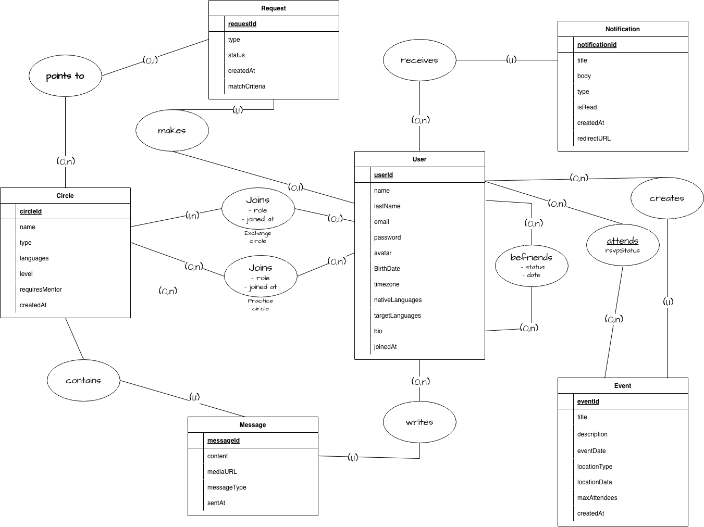
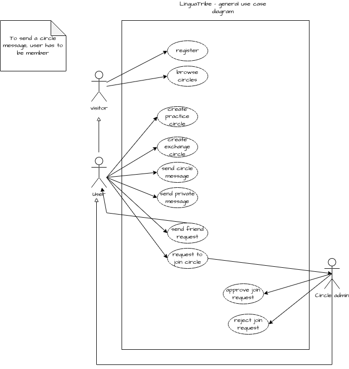
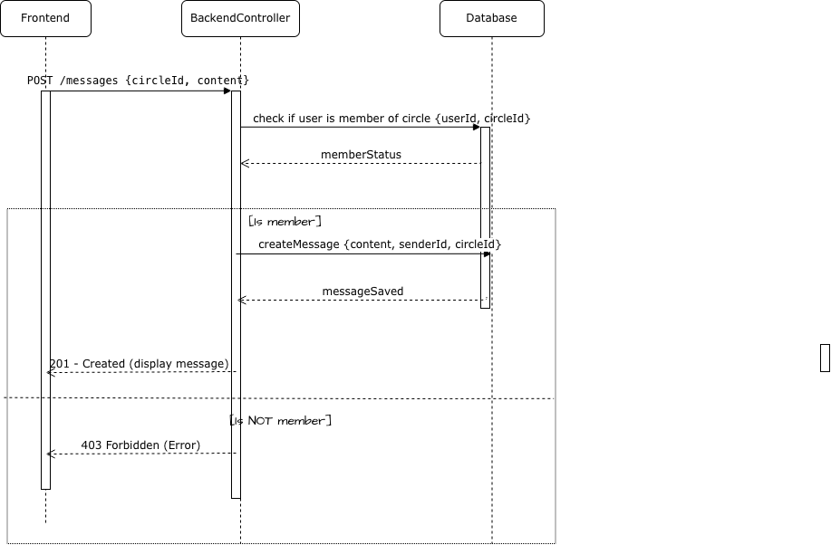

#  LinguaTribe

**LinguaTribe** is a language exchange platform dedicated to creating a secure environment for authentic learning. Our mission is to bridge the gap between fun and safety, moving away from the "dating app" vibe common in the industry. Whether through our community groups or one-on-one sessions, we prioritize a respectful space where users can focus on fluency and friendship without the pressure of unwanted advances.

## 📃 Summary
* 🌴 [Presentation](#-presentation)
* 📊 [Diagrams](#-diagrams)
* 📁 [Project Structure](#-project-structure)
* 🔧 [Tech Stack](#-tech-stack)
* ⚙️ [Installation & Configuration](#-installation--configuration)
* 🚀 [Getting Started](#-getting-started)
* 🏛️ [Service Architecture](#-service-architecture)
* 🤖 [Continuous Integration (CI)](#-continuous-integration-ci)
* 🧪 [Testing](#-testing)
* 🌏 [Roadmap](#-roadmap) 

## 🌴 Presentation

Many language learners struggle to find consistent and safe environments for practice. **LinguaTribe** solves this by:

* 🔍 **Smart Matching**: Groups based on interests, availability and language proficiency
* 🛡️ **Safe Space**: A non-romantic, strictly educational focus.

---

## 📊 Diagrams

### MCD Merise Diagram

# 

### Use case Diagram

# 

### Sequence Diagram

# 

## 📁 Project Structure

This project is a **monorepo**:

```text
circles-app/
├── api/            # 🌐 Backend (NestJS)
├── client/         # 🖥️ Frontend (React + Vite)
├── docker-compose.yml
├── lefthook.yml
├── .env.example
└── .github/
     └── workflows/
```

## 🔧 Tech Stack

| Component | Stack |
| :--- | :--- |
| **Frontend** | React, TypeScript, Vite, Tailwind CSS |
| **Backend** | NestJS (Node.js), TypeScript |
| **Database** | MongoDB (Mongoose) |
| **CI/CD** | GitHub Actions |
| **Containerization** | Docker & Docker Compose |


## ⚙️ Installation & Configuration
### 1. Prerequisites
* **Docker Desktop** installed and running.

* **Node.js 20+** (if running outside Docker).

### 2. Clone the repo
```text
   git clone https://github.com/2024-devops-alt-dist/microSaas_LDF.git
   cd microSaas_LDF/
```

### 3. Configure Environment Variables
Create a file named .env in the root of your project and define the necessary environment variables
Dont forget to also creat a .env on the api repository with the same structure as the .env.example.

| Variable | Description | Default(local) | Default(docker) |
| :--- | :--- |:--- |:--- |
| `PORT` | Port where the API runs | `3000` | `3000`|
| `DATABASE_URL`| MongoDB Connection String | mongodb://[USER]:[PASSWORD]@**localhost**:27017/microsaas-bdd?authSource=admin |  mongodb://[USER]:[PASSWORD]@**mongodb**:27017/microsaas-bdd?authSource=admin |
| `JWT_SECRET` | Secret key for token signing | yoursecret | yoursecret |
| `FRONTEND_URL`| URL of the React client | `http://localhost:5173` | `http://localhost:5173` |

## 🚀 Getting Started


To launch the entire application (Frontend + Backend + Database):

`docker-compose up -d --build`

Once all services are up and running, you can access the application at the following URLs:

| Service | Local URL |
| :--- | :--- |
| **Frontend** | [http://localhost:5173](http://localhost:5173) |
| **Backend** | [http://localhost:3000](http://localhost:3000) |
| **Database** | `localhost:27017` |
| **API Health** | [http://localhost:3000/api/health](http://localhost:3000/api/health)  |


### Useful Commands 🐋

Stop the application: `docker-compose down` (stops and removes containers, but preserves database data).

View the status of services: `docker-compose ps`

View logs: `docker-compose logs -f`.

**Note on Docker Volumes:**

* I'm using Bind Mounts for source code to enable instant hot-reload.

* I'm using Anonymous Volumes for node_modules to isolate container-specific dependencies from the host environment.

* I'm using Named Volumes (mongodb-data) to ensure database persistence across container restarts.


## 🏛️ Service Architecture

This monorepo follows a decoupled architecture where the frontend and backend communicate via a RESTful API.

### Backend (`/api`)
* Framework: NestJS (Node.js) with TypeScript.

* Database: MongoDB via Mongoose ODM.

* Features: JWT Authentication, Role-based access, and automated health checks.

* Documentation: Swagger/OpenAPI documentation is available at http://localhost:3000/api/docs (when running).

### Frontend (`/client`)
* Framework: React 18+ powered by Vite.

* Styling: Tailwind CSS for a modern, responsive UI.

* State Management: React Hooks and Context API for global state.

* Performance: Optimized build using Vite’s lightning-fast bundling.

## 🤖 Continuous Integration (CI)
The Github actions workflow (`.github/workflows/ci.yml`), automatically validates every push and pull request to the main and develop branches to maintain high code quality.

| Job | Description |
| :--- | :--- |
| **Backend Checks** | Validates code formatting (Prettier), runs the NestJS linter, and performs a high-level security audit on dependencies. |
| **Frontend Checks** | Runs formatting and linting rules, executes the production build, and audits npm packages for vulnerabilities. |
| **Docker Validation** | Uses Hadolint to analyze the Dockerfile of both API and Client, ensuring best practices and optimized image layers. |


## 🧪 Testing

### Backend (`/api`)
Unit Tests: Focused on Services and Helpers using Jest. I validate that circle membership logic and language requirements are strictly met.

E2E Tests: Comprehensive flow testing using Supertest. I simulate complete user journeys: Register -> Login -> Join Circle -> Send Message.

* Run all backend tests
`cd api && npm run test`

* Run e2e tests specifically
`cd api && npm run test:e2e`

### Frontend (`/client`)
Component Testing: Using React Testing Library and Vitest. I ensure that high-stakes components like AuthGuard and BottomNav behave correctly under different user states.

* Run vitest suite
`cd client && npm test`


## 🌏 Roadmap

### Completed ✅
* Infrastructure: Monorepo configuration with Docker and Docker Compose.

* Backend (NestJS):

    Robust Authentication with JWT.

    User management and profile handling.

    Core Circles logic and Request system.

    Real-time messaging via WebSockets.

* Frontend (React):

    Initial setup with Vite and Tailwind CSS.

    Registration and Login flows connected to the backend.

    Main Layout and Homepage with dynamic Header (Timezone-aware).

### Pending / In Progress ⏳
* Home Integration: Connecting "Find a Partner" and "Find a Circle" carrusels to real backend endpoints.
* Social Auth: Implementation of Google and social media login.
* Group message withing a circle
* Profile management
* Notifications: System for new requests and messages (Planned for next release).
* Events: Module for creating and managing meetups or study sessions (Planned for next release).
