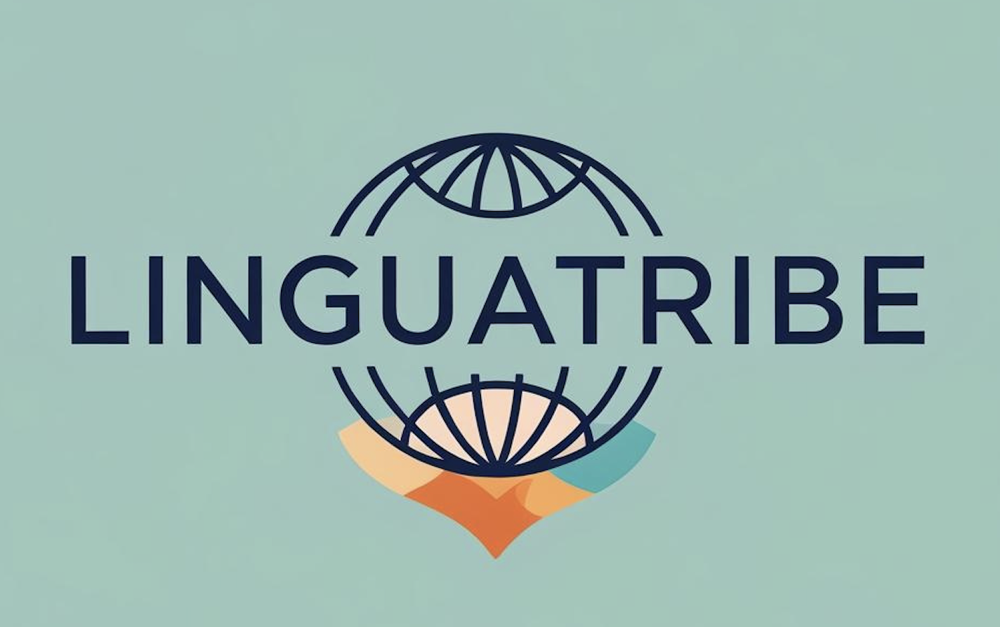

#  LinguaTribe - Frontend

This is the React client for LinguaTribe, built with **Vite** and **TypeScript**.

## 🛠️ Development Setup

1. **Install dependencies:**
`npm install`

2. **Run locally**

`npm run dev`

3. **Build for production**

`npm run build`

## 🧪 Testing

Using Vitest and React Testing Library.

`npm test`

## 🎨 Key Stack

* Styling: Tailwind CSS.
* Icons: Lucide React / React Icons (el que uses).
* State Management: Context API / Hooks.